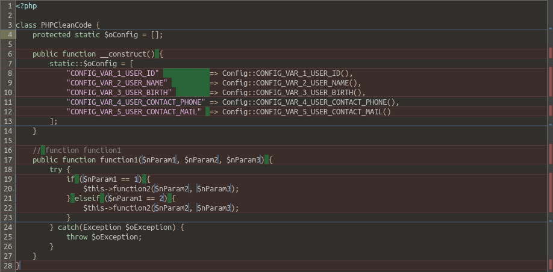

## PHP Clean Code

Visual Studio Code Extension designed to help PHP developers keep their code clean, readable, and consistent

## Features

- Align the => operators in multiline associative arrays
- Format opening and closing braces
- Format comments
- Format function parameters
- Format control structures
- Removes multiple consecutive empty lines
- Removes empty lines inside the blocks at the beginning and at the end
- Removes unnecessary spaces in opening and closing parentheses

## Before

## After

## Usage

1. Open a PHP file
2. Right click and select "PHP Clean Code" or use the command palette (Ctrl+Shift+P) and search for "PHP Clean Code"

## Settings

This extension contributes the following settings:
* `php-clean-code.formatAssociativeArrayAlignment`: Align the => operators in multiline associative arrays
* `php-clean-code.formatBraces`: Format opening and closing braces
* `php-clean-code.formatComments`: Format comments
* `php-clean-code.formatFunctionParams`: Format function parameters
* `php-clean-code.formatKeywords`: Format control structures
* `php-clean-code.removeMultipleEmptyLines`: Removes multiple consecutive empty lines
* `php-clean-code.removeBlockInitEndEmptyLines`: Removes empty lines inside the blocks at the beginning and at the end
* `php-clean-code.formatParentheses`: Removes unnecessary spaces in opening and closing parentheses

## Requirements

* Visual Studio Code 1.75.0 or higher
* PHP files

## Source Code

* https://github.com/iricartb/vsce-php-clean-code

## Author

* Ivan Ricart
* iricartb@gmail.com
* https://github.com/iricartb
* https://www.linkedin.com/in/ivan-ricart-borges